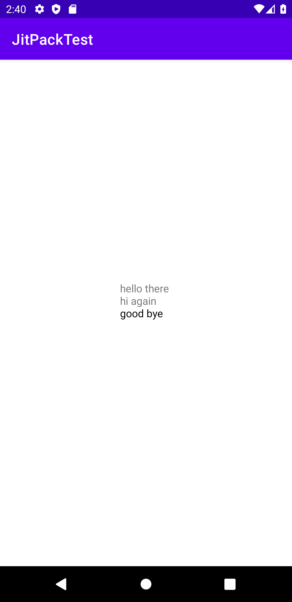

# JitPackTest

I have a library that is published through JitPack:
[LogCatCollector](https://github.com/applearrow/LogCatCollector).
In this project I'm just using that library.

In the project build.gradle file, add jitpack.io as a maven repo:

```groovy
allprojects {
    repositories {
        google()
        jcenter()
        maven { url 'https://jitpack.io' }
    }
}
```

Then in the android module build.gradle file, add an implementation dependency against our library:

```groovy
dependencies {
    implementation 'com.github.applearrow:LogCatCollector:0.1'
    implementation 'com.jakewharton.timber:timber:4.7.1'
}
```

[](app/doc/images/screenshot1.png)
